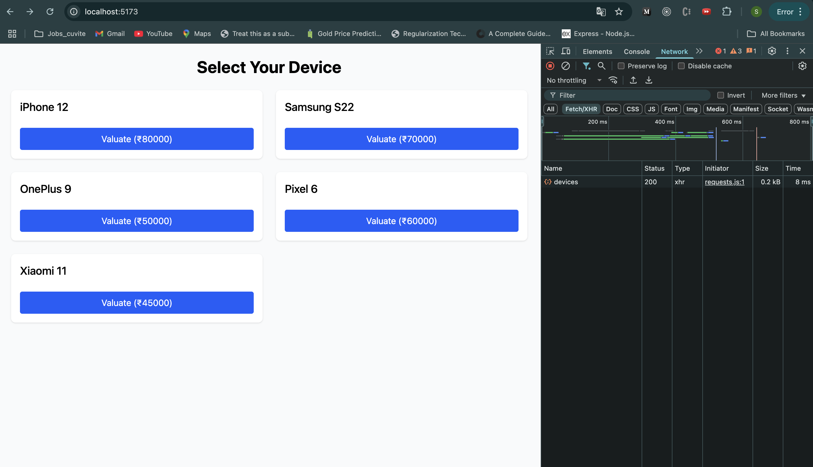
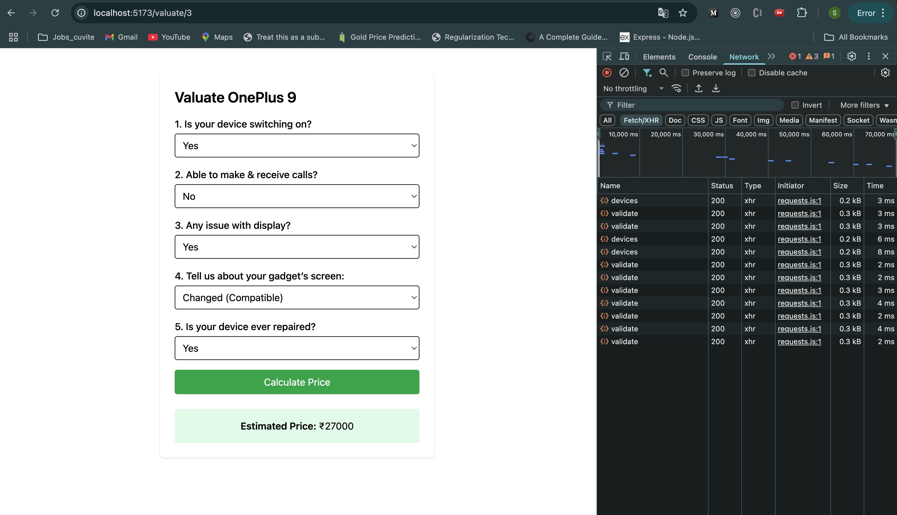

# Device Valuation App

A simple MERN + Vite application that helps users get an estimated resale price for their smartphones based on condition.

---

## 🔍 Features

* **Condition Survey**: Answer 5 questions about power, calls, display, screen replacement, and repair history.
* **Price Calculation**: A straightforward algorithm deducts fixed amounts for each issue and returns an estimated price.
* **REST API**: Backend built with Node.js, Express, and hard-coded device data.
* **Modern Frontend**: React + Vite + Tailwind for a fast, responsive UI.

---

## 🛠️ Tech Stack

* **Backend**: Node.js, Express
* **Frontend**: React, Vite, Tailwind CSS
* **API Communication**: axios

---

## 💾 Setup & Run

### 1. Clone the repo

```bash
git clone <your-repo-url>
```

### 2. Start Backend

```bash
npm install
npm run dev
```

* Runs on [http://localhost:3000](http://localhost:3000)

### 3. Start Frontend

```bash
cd hellofiClone-Frontend
npm install
npm run dev
```

* Runs on [http://localhost:5173](http://localhost:5173) (or as configured)

### 4. Use the App

* Open your browser to [http://localhost:5173](http://localhost:5173)
* Select a device, answer condition questions, and get the estimated price.

---

## 🖼️ Screenshots

### Device List



### Valuation Form & Result


